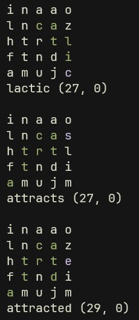

# Running
A beta release of the spellcast solver!

Unzip the file, then run the `spellcast_solver.exe` to see it in action.

Modify the `shape_temp.txt` file accordingly, and replace `words.txt` file with your own words list if you wish.

# Notes
When modifying `shape_temp.txt` be mindful of how word multipliers, letter multipliers, and gems are denoted.

`[2/3][D/T][£]c`
Breaking this down, _word multipliers_ multiply the **total** word's value after any _letter multipliers_ are applied for each letter.
- `2` for 2x word multiplier
- `3` for a 3x word multiplier
Whereas, 
- `D` doubles the letter's value
- `T` triples the letter's value
 
Thereafter, whether a letter has a gem or not is indicated by `£`.

Please refer to this link [here](https://discord.fandom.com/wiki/SpellCast#Mechanics) for more information.

Have fun :).

# Example

